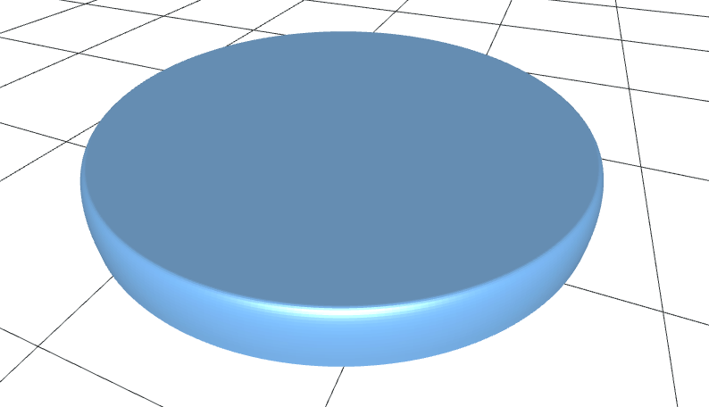
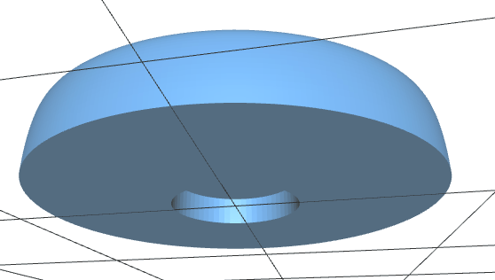
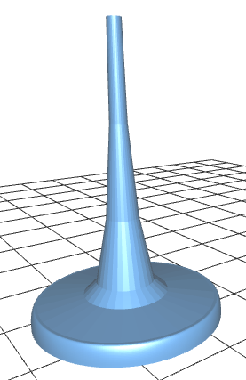
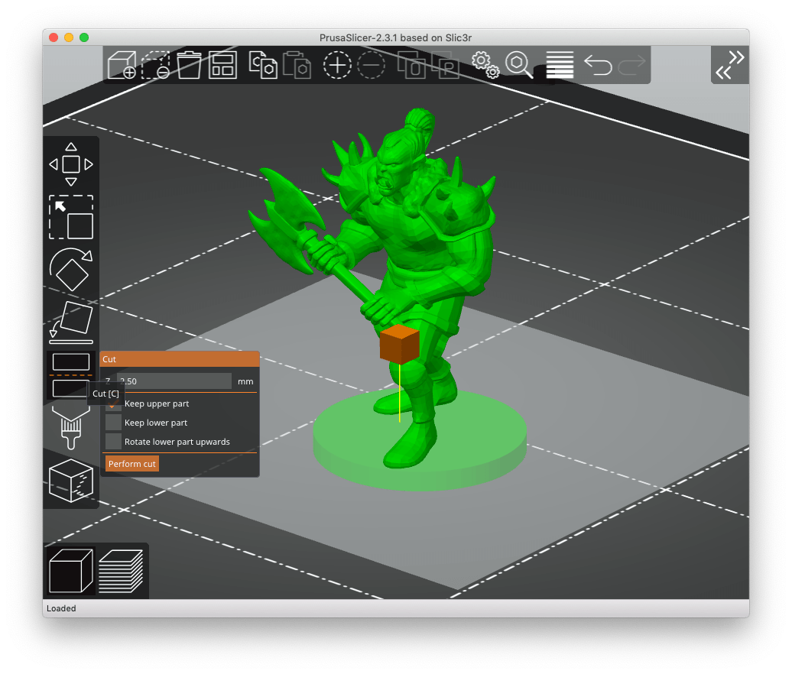
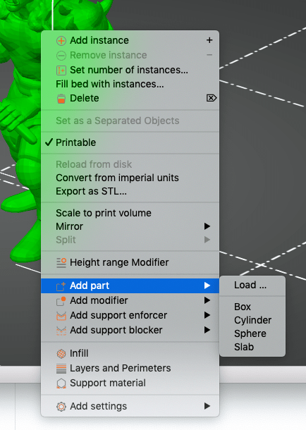
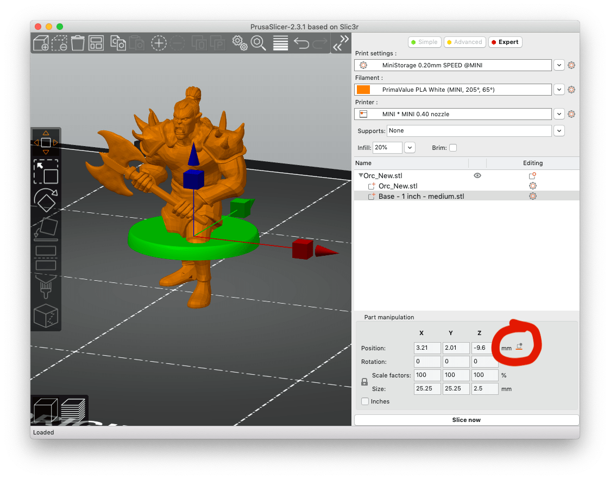
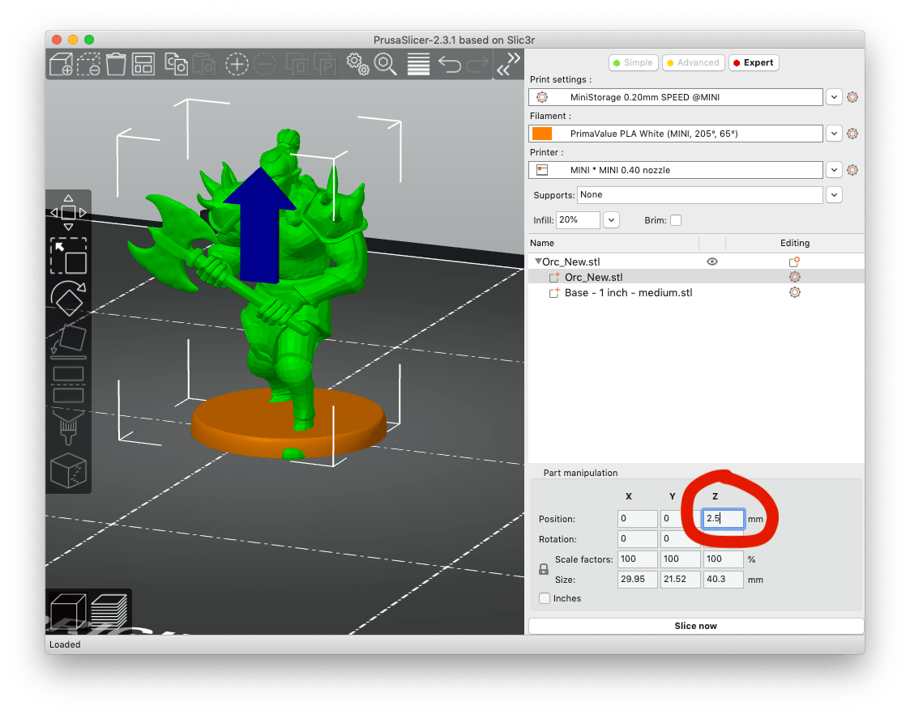
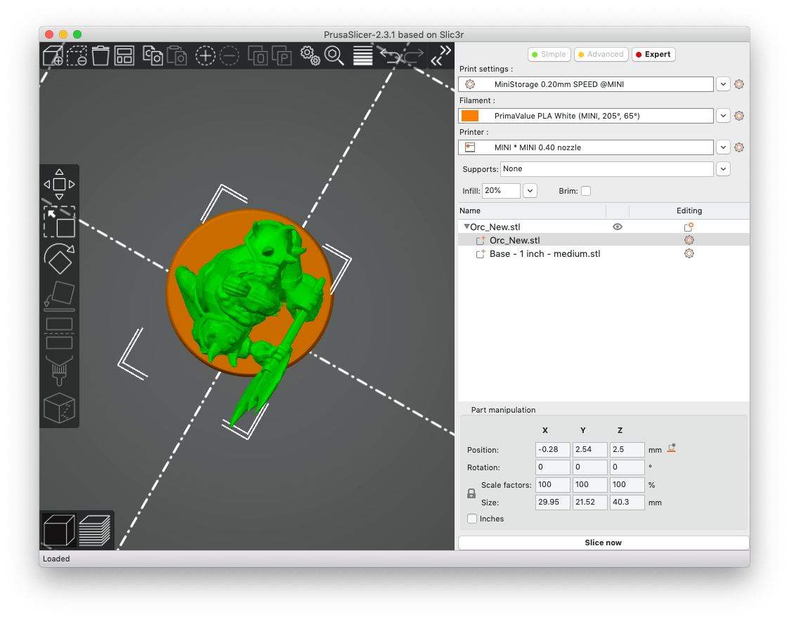

<h1 align="center">MiniBase</h1>

Magnetic bases for standard 28/32 mm tabletop miniature models

  <a href="#about">About</a> •
  <a href="#download">Download</a> •
  <a href="#instructions">Instructions</a> •
  <a href="#faqs">FAQs</a> •
  <a href="#credits">Credits</a> •
  <a href="#license">License</a>

## About

Plain tabletop miniature bases with smooth edges and a cylindrical cutout on the bottom for cylinder magnets.

Meant to be used as a replacement for original mini bases which:  

- either have no magnet cut out
- and/or look ugly. 

 

#### Key features:

- compatible with my magnetic [Number Token Bases](https://www.thingiverse.com/thing:4632098)
- compatible with my customizable [Mini Boxes](https://github.com/manolitto/minibox)

## Instructions

- Use your slicer software to cut away the original base of your miniature model
- Add the appropriate magnetic mini base to your 3D model, or
- alternatively print the miniature and the corresponding base separately and glue your mini to the base.

### Detailed steps in Prusa Slicer:

1. Remove the old base with the cut tool (use 2.50 mm for medium mz4250 models)
   

2. Add the new base as "part"
   

3. Drop both the model and the base to the print bed
   

4. Raise the model by 2.5 mm (= the height of the new base)
   

5. Center align the model if necessary
   

## Download

You can find the latest release [here](https://github.com/manolitto/minibase/releases/latest).

## FAQs

**Question:** What size are the magnets on the bottom of these bases?

**Answer:** Axially magnetized cylinder magnets with a diameter of 5 mm (~ 2/10") and thickness of 1 mm (~ 1/32" - 1/24").

---

## Credits

Based on and remixed from the [Creature Bases by Miguel Zavala alias "mz4250"](https://www.thingiverse.com/thing:2907324)

## License

 OpenVLex 2 is licensed under a <a rel="license" href="http://creativecommons.org/licenses/by-sa/4.0/">Creative Commons Attribution-ShareAlike 4.0 International License</a>.
